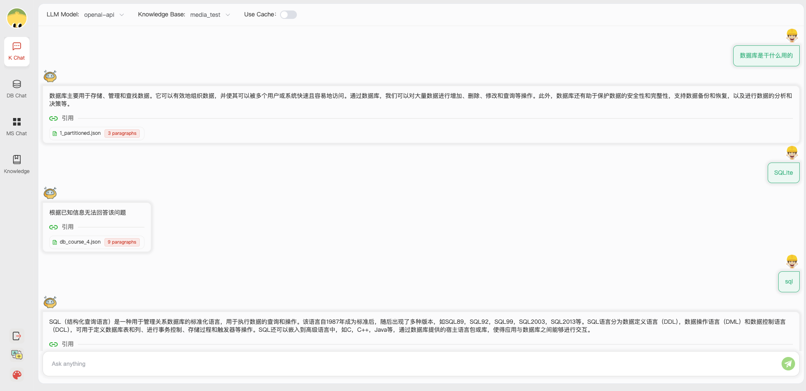
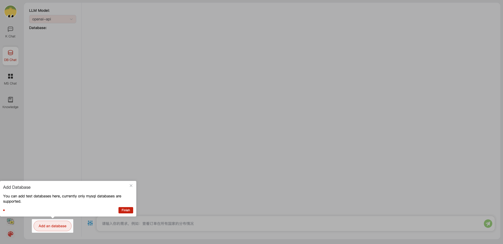
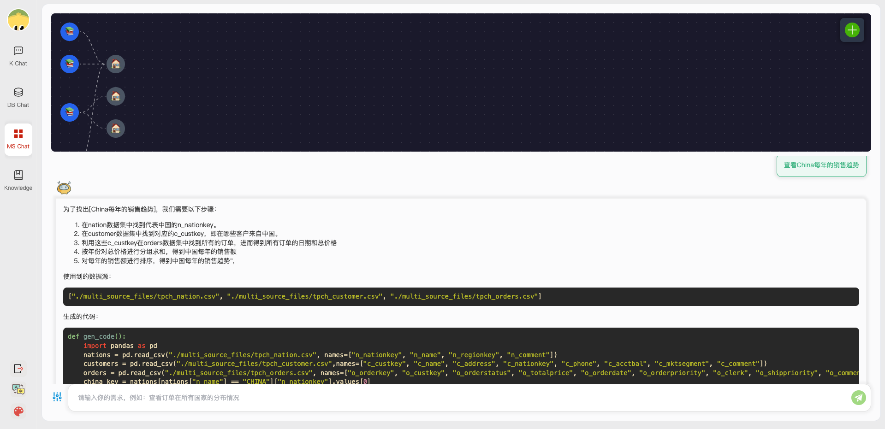
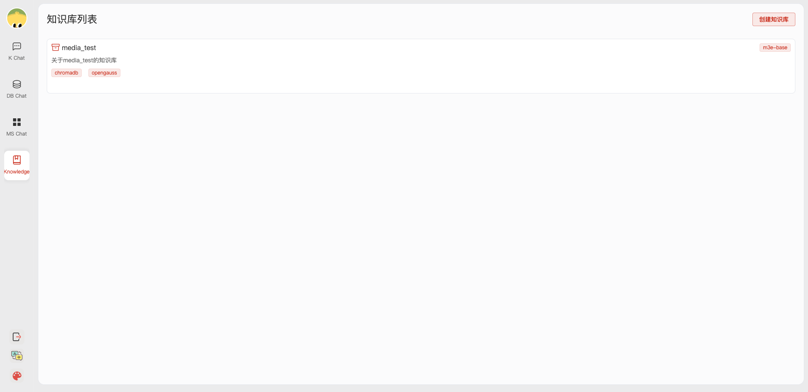
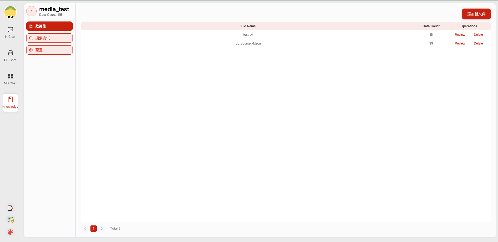

<p align="center">
    【English | <a href="README_Chinese.md">中文</a>】
</p>

# 🕹 Quick Start

## 1. Getting Started

### Environment Setup

1. Backend Environment Setup

First, ensure your machine has Python 3.8 - 3.10 installed.
```
$ python --version
Python 3.10.12
```
Next, create a virtual environment and install the project dependencies within it.

```shell

# Clone the repository
$ git clone https://github.com/zhouxh19/ChatBase.git

# Enter the directory
$ cd ChatBase

# Install all dependencies
$ pip3 install -r requirements.txt 

# To run only the API service
$ pip3 install -r requirements_api.txt 

# The default dependencies include the basic runtime environment (Chroma-DB vector library). If you want to use other vector libraries, uncomment the corresponding dependencies in requirements.txt before installing.
```

2. Frontend Service Setup

+ First, ensure your machine has Node (>= 18.15.0) installed.
```
$ node -v
v18.15.0
```
Next, install the project dependencies.
```shell
cd webui
# pnpm address https://pnpm.io/zh/motivation
# Install dependencies (Recommend using pnpm)
# You can use "npm -g i pnpm" to install pnpm 
pnpm install
```

3. Download Embedding Model from [HuggingFace](https://huggingface.co/models).

To download the model, you need to install [Git LFS](https://docs.github.com/zh/repositories/working-with-files/managing-large-files/installing-git-large-file-storage) first, then run:

```Shell
$ git lfs install
$ git clone https://huggingface.co/moka-ai/m3e-base
```

Adjust the [model settings](configs/model_config.py.example) to the download path, for example:

```Python
EMBEDDING_MODEL = "m3e-base"
LLM_MODELS = ["Qwen-1_8B-Chat"]
MODEL_PATH = {
    "embed_model": {
        "m3e-base": "m3e-base", # Download path of embedding model.
    },

    "llm_model": {
        "Qwen-1_8B-Chat": "Qwen-1_8B-Chat", # Download path of LLM.
    },
}
```

4. Modify Configuration Files

Copy the configuration files and check each file's comments to modify them according to your needs.
```shell
$ python copy_config_example.py
# The generated configuration files are in the configs/ directory
# basic_config.py is the basic configuration file and doesn't need to be modified.
# kb_config.py is the knowledge base configuration file, you can modify DEFAULT_VS_TYPE to specify the storage vector library of the knowledge base, and you can also modify the relevant paths.
# model_config.py is the model configuration file, you can modify LLM_MODELS to specify the models used. The current model configuration is mainly for knowledge base search, diagnostic-related models have some hard coding in the code, and will be unified here later.
# prompt_config.py is the prompt configuration file, mainly for LLM dialogue and knowledge base prompts.
# server_config.py is the service configuration file, mainly for the service port number, etc.
```

**!!! Note: Please modify the following configurations before initializing the knowledge base, otherwise it may cause database initialization failure.**

* model_config.py
```shell
# EMBEDDING_MODEL   Vectorization model, if you choose a local model, download it to the root directory as needed.
# LLM_MODELS        LLM, if you choose a local model, download it to the root directory as needed.
# ONLINE_LLM_MODEL  If you use an online model, modify the configuration.
```

* server_config.py
```shell
# WEBUI_SERVER.api_base_url   Pay attention to this parameter. If deploying the project on a server, modify the configuration.
```

4. Initialize the Knowledge Base

Initialize your knowledge base and simply copy the configuration files as follows:
```shell
$ python init_database.py --recreate-vs
```

### One-Click Start

Start the project with the following command:
```shell
$ python startup.py -a
```

Example of the startup interface

If it starts successfully, you will see the following interface:

1. RAG Dialogue  Page



2. Database Dialogue Page:

- Database Dialogue Start Page:



- Database Dialogue History Page:


3. Multi-file Linked Dialogue Page:



4. Knowledge Base Page

- Knowledge Base Management Page:



- Knowledge Base Details Page:



## ⏱ Todo

- Data-Driven workflow orchestration

- ES Service