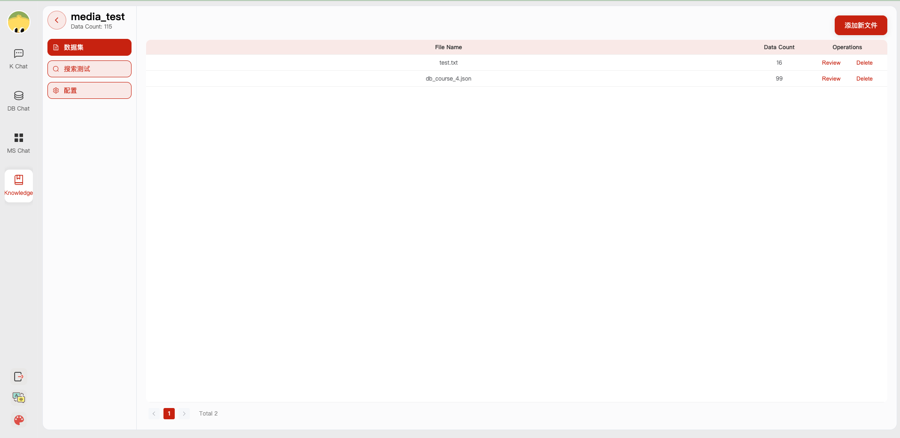

# 🕹 快速开始

## 1. 快速上手

### 环境配置

1. 后端环境配置

首先，确保你的机器安装了 Python 3.8 - 3.10
```
$ python --version
Python 3.10.12
```
接着，创建一个虚拟环境，并在虚拟环境内安装项目的依赖

```shell

# 拉取仓库
$ git clone https://github.com/zhouxh19/ChatBase.git

# 进入目录
$ cd ChatBase

# 安装全部依赖
$ pip3 install -r requirements.txt 
# 仅运行API服务
$ pip3 install -r requirements_api.txt 

# 默认依赖包括基本运行环境（Chroma-DB向量库）。如果要使用其它向量库，请将 requirements.txt 中相应依赖取消注释再安装。
```

2. 前端服务配置
+ 首先，确保你的机器安装了 Node (>= 18.15.0)
```
$ node -v
v18.15.0
```
接着，安装项目依赖
```shell
cd webui
# pnpm address https://pnpm.io/zh/motivation
# install dependency(Recommend use pnpm)
# you can  use "npm -g i pnpm" to install pnpm 
pnpm install
```

3. 从 [HuggingFace](https://huggingface.co/models) 下载Embedding 模型。

下载模型需要首先安装 [Git LFS](https://docs.github.com/zh/repositories/working-with-files/managing-large-files/installing-git-large-file-storage)，然后运行

```Shell
$ git lfs install
$ git clone https://huggingface.co/moka-ai/m3e-base
```

调整 [模型设置](configs/model_config.py.example) 为下载路径，如

```Python
EMBEDDING_MODEL = "m3e-base"
LLM_MODELS = ["Qwen-1_8B-Chat"]
MODEL_PATH = {
    "embed_model": {
        "m3e-base": "m3e-base", # Download path of embedding model.
    },

    "llm_model": {
        "Qwen-1_8B-Chat": "Qwen-1_8B-Chat", # Download path of LLM.
    },
}
```

4. 修改配置文件

复制配置文件，注意查看每个文件的注释，根据自己需求修改
```shell
$ python copy_config_example.py
# 生成的配置文件在 configs/ 目录下
# basic_config.py 是基础配置文件，不需要修改
# diagnose_config.py 是诊断配置文件，需要根据自己的环境修改。
# kb_config.py 是知识库配置文件，可以修改DEFAULT_VS_TYPE来指定知识库的存储向量库等，也可以修改修改相关的路径。
# model_config.py 是模型配置文件，可以修改LLM_MODELS来指定使用的模型,当前模型配置主要针对知识库搜索，诊断相关的模型还有一些硬编码在代码中，后续会统一到这里。
# prompt_config.py 是prompt配置文件，主要是LLM对话和知识库的prompt。
# server_config.py 是服务配置文件，主要是服务的端口号等。
```

**!!! 注意，请在初始化知识库之前修改以下配置，否则可能会导致数据库初始化失败。**

* model_config.py
```shell
# EMBEDDING_MODEL   向量化模型，如果选择本地模型，需要按需下载到根目录。
# LLM_MODELS        LLM，如果选择本地模型，需要按需下载到根目录。
# ONLINE_LLM_MODEL  如果使用线上模型，需要修改配置。
```

* server_config.py
```shell
# WEBUI_SERVER.api_base_url   需要关注这个参数，如果是在服务器上部署项目，则需要修改配置。
```


4. 初始化知识库

按照下列方式初始化自己的知识库和简单的复制配置文件
```shell
$ python init_database.py --recreate-vs
 ```

### 一键启动

按照以下命令启动项目
```shell
$ python startup.py -a
```

启动界面示例

如果正常启动，你将能看到以下界面

1. RAG对话页面


2. 数据库对话页面：

- 数据库对话起始页面：


- 数据库对话历史页面：


3. 多文件联动对话页面：


4. 知识库页面

- 知识库管理页面：


- 知识库详情页面：



## 📒 Citation
Feel free to cite us if you like this project.

```bibtex
@article{chat2datademo2024,
      author={Xinyang Zhao, Xuanhe Zhou, Guoliang Li},
      title={Chat2Data: An Interactive Data Analysis System with RAG, Vector Databases and LLMs}, 
      journal={Proc. {VLDB} Endow.},
      year={2024}
}
```